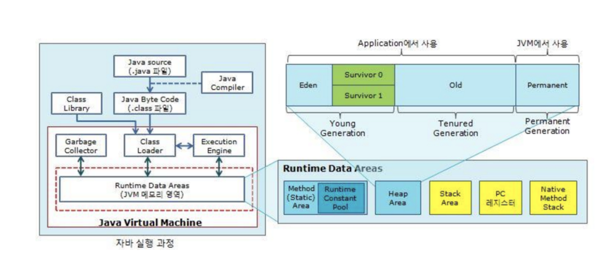
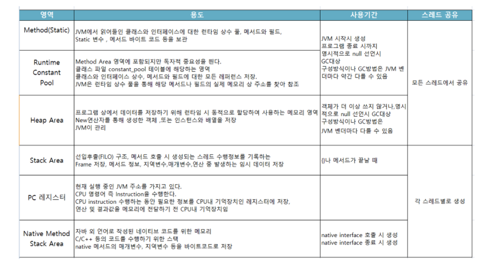

- 자바에서 main 함수에서 파라미터 받는 부분을 왜 string type일까? 
 : 참고URL : https://m.blog.naver.com/PostView.nhn?blogId=crazydeicide&logNo=130114957734&proxyReferer=https://www.google.com/
- JAVA8 에서 변경된 interface 기능 정리? 
 : 참고URL : http://doohyun.tistory.com/47
- jvm 영역 다시 보기 

 : **Java Compiler(자바 컴파일러)**에 의해 Java source(.java) 파일은  Byte code로 변환된다. 
 : **Class Loader(클래스 로더)**는 이 변환된 Byte code(.class) 파일을 JVM 내로 class를 로드하고 Link작업을 통해 배치 등 일련의 작업을 한다. 또 런타임시 class를 load한다. 
 : **Execution Engine(실행 엔진)** 은 Class Loader를 통해 JVM 내부로 넘어와 Runtime Data Area(JVM 메모리)에 배치된 Byte code들을 명령어 단위로 실행시킨다 
 : **GC(Garbage Collector)**는 어플리케이션이 생성한 객체의 생존 여부를 판단하여, 더이상 참조되지 않거나 null 인 객체의 메모리를 해체시켜 메모리 반납을 한다.  
 : **Runtime Data Areas(JVM 메모리)** 런타임 데이터 영역은 JVM메모리로 Java 어플리케이션이 실행하면서 할당받은 메모리영역이다. 
 : JVM 메모리 영역(하단 캡쳐) 

 
<다음 스터디 일정 및 정리 내용>
- 책 : 이것이 자바다
- 5장 참조 타입 부터 ~
- 일요일 11:00 ~
- 위치 : 강남역 부근 